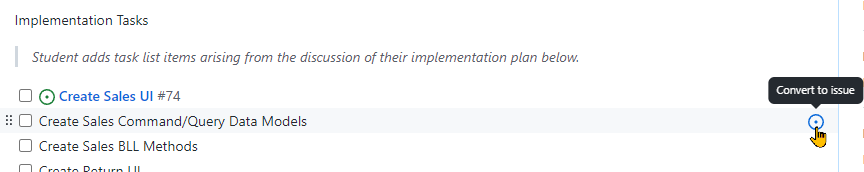

# Deliverable 1 - **Development Planning**

In the `ReadMe.md` at the root of your repository, include each team member's full name and GitHub username along with their chosen/assigned subsystem name.

In GitHub, create a **milestone** for each project deliverable with the assigned due dates. The milestones should be set up along both shared and individual responsibilities for this project. For example, the [**Project Setup**](./Deliverable-2.md) milestone is one where the issues associated with the milestone will be distributed amongst the whole team. But for each team member, they will need additional milestones related to their specific scenario. *E.g.: If your scenario is "Sales", then you will have these extra milestones:*

- **Sales Development Plan** - Your [*implementation plan*](#implementation-plan) for the first deliverable
- **Sales Subsystem** - The working implementation of the Sales Subsystem (the last deliverable)

Your milestones are to be associated with GitHub Issues that you generate for your repository. All of your work in this lab is to be associated with git commits that reference your GitHub Issue(s). Your instructor will be using these to track your progress and participation in this project.

The remaining part of this *Development Planning* deliverable is where you document *your* plan for how you will implement *your* chosen scenario.

> You are expected to make **regular** and **frequent** commits while working on this project. **Begin early** to ensure that you have enough time to complete this group project!

## Implementation Plan

Create an initial issue where you document your overall implementation plan. This implementation plan for your scenario must address the following areas of concern. You can detail your thoughts on each area as comments to this initial issue.

- **UI Design Implementation**
  - Identify HTML elements for various parts of the UI
  - Identify which buttons/links trigger POST and GET requests
  - Include mock-up images of the user interface
- **Data Modelling**
  - Identify the distinct data models for the **command** and **query** aspects of the UI Design needs and the business processing needs of the system
- **Business Processing**
  - Identify specific method signatures that you would need to create for the Business Logic Layer (BLL), including the parameter types and return type of the methods.
  - For each BLL method, identify the tables/entities you will need to work with along with any important business processing requirements for the method.

The description of the issue should include a high-level Task-List of work that would need to be done. These task-list items can then be turned into their own issues for the [coding phase](./Deliverable-3.md) of the project. For example,

<!--

Your written **implementation plan** for your scenario must follow the guidelines and examples **as demonstrated by your instructor**. Place your documentation in a subfolder with *your* name at the root of the repository. For example, if your instructor requires a markdown document and your name is *Stewart Dent*, then your documentation file path would be `/StewDent/ReadMe.md`. All the supporting files for your documentation (raw diagram files and images) must also be placed in this folder.

The content and structure of your documentation will be **directed by your instructor**. Be aware that each instructor may choose various characteristics to be part of your documentation, which may include (but not be limited to) some or all of the following components.

- **User Interface Mockups** - Mockup images of the screens/web pages that the user interacts with. These may consist of entire screen mockups or mockups of parts of the screen that reflect key perspectives of the user's interaction with the application.
- **UI/BLL/DAL Mappings** - Charts or lists detailing the UI events/interactions and how they map through calls to the BLL and DAL of your subsystem.
- **Proposed View Models** - Coded classes acting as View Models for Command and Query behaviour.
- **Class Diagrams** - A set of class diagrams, one for each ViewModel used in the planning document.
- **Use Case Diagram** - A single diagram illustrating the interactions of the user with your subsystem.
- **Sequence Diagrams** - A set of sequence diagrams for each use case. The scope of the diagram only needs to include the presentation layer (user) and the business logic layer (BLL). It needs to clearly indicate the complete method signatures used when interacting with the BLL as well as the data types of information returned from the BLL.

Diagrams should be stored in your repository as **both** the **raw format** (`.bmpr` for a [Balsamiq](https://balsamiq.com/) diagram, `.xml` for a [Draw.io](https://www.draw.io/) diagram, or `.vdx` for a Visio download of a [LucidChart](https://www.lucidchart.com/) diagram) and as **individually exported images**. The individual images must be embeded in your `ReadMe.md` (see this [markdown guide](https://docs.github.com/en/github/writing-on-github/getting-started-with-writing-and-formatting-on-github/basic-writing-and-formatting-syntax) for embedding images).
-->

----

*Back to the [General Instructions](./ReadMe.md)*
